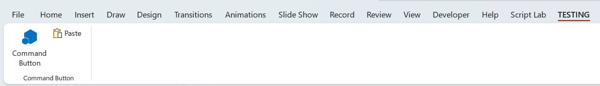

# AddinCommands
I have created a simple manifest file and tried to include a built-in command using the 'OfficeControl' tag.

The command is displayed in PowerPoint, but not in Excel or Word.

<A href="https://learn.microsoft.com/en-us/office/dev/add-ins/design/built-in-button-integration">learn.microsoft.com/en-us/office/dev/add-ins/design/built-in-button-integration</a>

The documentation says that this is only supported in PowerPoint at the moment
[https://learn.microsoft.com/en-us/office/dev/add-ins/design/built-in-button-integration]


```
<Group id="ExecuteButtonGroupId">
   <Label resid="ExecuteButton_Label"/>
   <Icon>
      <bt:Image size="16" resid="BET_16x16"/>
      <bt:Image size="32" resid="BET_32x32"/>
      <bt:Image size="80" resid="BET_80x80"/>
   </Icon>
   <Control xsi:type="Button" id="ExecuteButtonId">
      <Label resid="ExecuteButton_Label"/>
      <Supertip>
         <Title resid="ExecuteButton_Label"/>
         <Description resid="LS_Supertip"/>
      </Supertip>
      <Icon>
         <bt:Image size="16" resid="BET_16x16"/>
         <bt:Image size="32" resid="BET_32x32"/>
         <bt:Image size="80" resid="BET_80x80"/>
      </Icon>
      <Action xsi:type="ExecuteFunction">
         <FunctionName>ButtonPressedEvent</FunctionName>
      </Action>
   </Control>

   <OfficeControl id="Paste" />
</Group>
```


<H3>PowerPoint Desktop Application</H3>
When the manifest is side loaded into PowerPoint, the Paste command is displayed.


<H3>Excel Desktop Application</H3>
When the manifest is side loaded into Excel, the Paste command is NOT displayed.


<H3>Word Desktop Application</H3>
When the manifest is side loaded into Word, the Paste command is NOT displayed.


